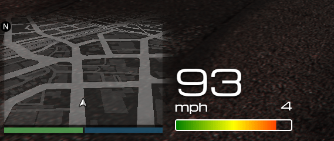

# aiden_vehicle_hud

Adds a HUD to the game UI that displays the vehicle speed, RPM and current gear.

This was mostly an experiment to familiarise myself with the natives around vehicles, I had some other stuff on the UI (such as vehicle health) but ultimately removed it to try and make it look a little less cluttered.

## Building

In order to build the project, run `yarn && yarn build` in this directory.

## UI

